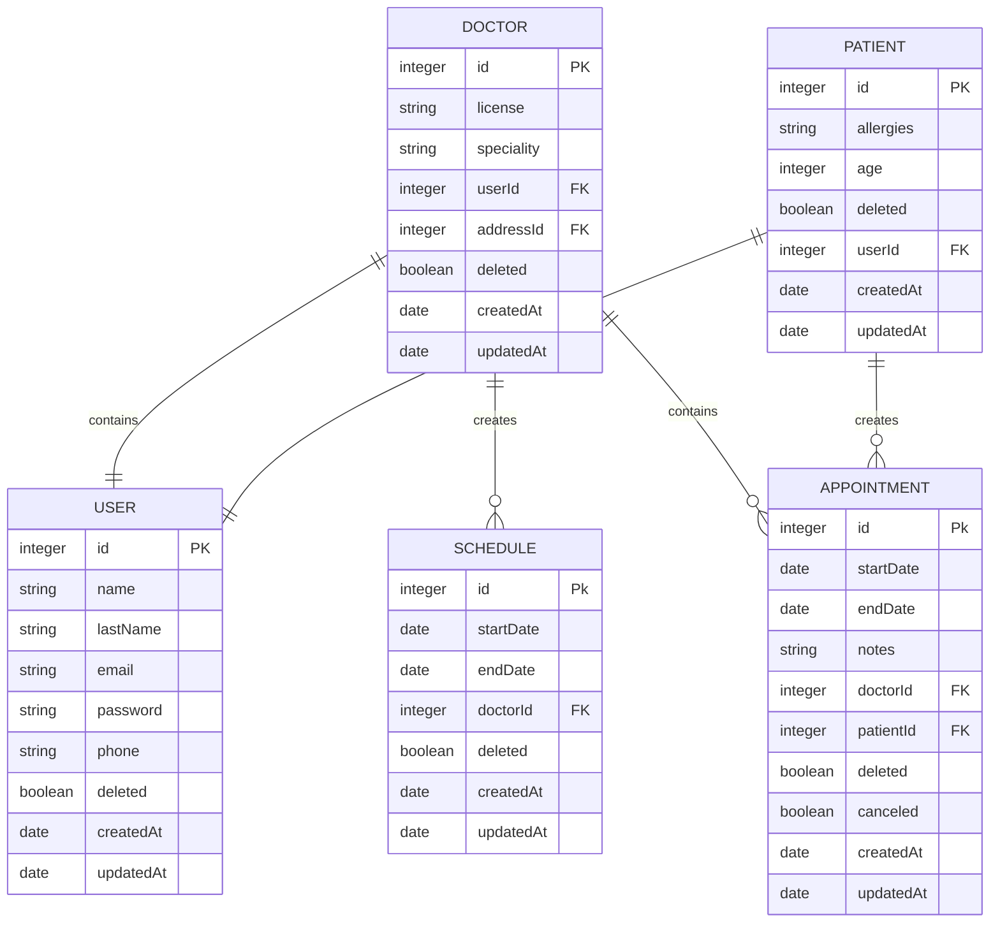

# Medical Appointments 👩🏼‍⚕️

## Summary

This is a project that permit to manage medical appointments

- 👩🏼‍⚕️👨🏼‍⚕️ If you are a doctor you can do an account and start to add your schedule, see your appointments scheduled by patients
- 🤒 If you are a patient you can do an account to see doctors, and make your appointments

### Main Entities

Entity Diagram Meanings

| Value (left) | Value (right) | Meaning                       |
| ------------ | ------------- | ----------------------------- |
| \|o          | o\|           | Zero or one                   |
| \|\|         | \|\|          | Exactly one                   |
| }o           | o{            | Zero or more (no upper limit) |
| }\|          | \|{           | One or more (no upper limit)  |

- PK -> PrimaryKey
- FK -> ForeignKey

## Techincal Structure Project

The stack in this project have the next technologies:

- Node Js -> Environment to write code with JavaScript from server side. Download in https://nodejs.org/es/download/
- Express -> Framework (https://expressjs.com/es/starter/hello-world.html)
- Sequelize -> ORM (https://openwebinars.net/blog/que-es-un-orm/).

**Table of Contents**

- [Folder Structure📁](#folder-structure-📁)
  - [server](#server)
  - [database](#database)
  - [config](#config)
- [Run the Project🚀](#run-the-project-🚀)
  - [Simple execution](#simple-execution)
  - [Using Docker](#using-docker)
- [Using Sequelize CLI](#using-sequelize-cli)
  - [Create Models](#1-create-model-and-migration)
  - [Create Migrations](#2-create-migrations)
  - [Execute Migrations](#3-execute-migrations)

## Folder Structure 📁

## server

The server folder contains the logic of business

- _index.js_ -> Here we create the express instance, eventually add middlewares.
- _controllers_ -> This folder contains the functions that permit develop the logical business.
- _middlewares_ -> Contains functions that work like intermediaries in the requests.
- _routes_ -> Files that containts the routes' names or end points.
- _utils_ -> Contains functions that work as auxiliaries

## database

In this folder we have the index file with the database connections, also the migrations (files with changes in the database) and models (files that representate the tables in the project)

## config

In the file environemnt, there is an object with env variables that are used in differents parts of the project

# Run the Project 🚀

To execute the project, you can do it in two ways, the first one without manage containers, and the second one using docker container

## Simple execution

To execute the project, you should do the next steps:

1. Install Node JS in your OS
2. Install PostgreSQL
3. Create a database in postgres
4. In the project's root create a file called .env where you will put the environment variables including credentials of the new database created, you should take the .env.example file as a reference
5. In the terminal you should go to the root folder and exec the next steps
6. `npm install` -> Install all package with npm install (the npm will be our Node Package Managment)
7. `npm run start` -> To run the server execute the script start (see in script section in package.json)

## Using Docker

1. You have to have installed Docker in your OS
2. In the project's root create a file called .env where you will put the environment variables, you should take the .env.example file as a reference
3. `docker compose up --build`: Execute de command to build the container
4. `docker compose up`: To up the project you only need this command

## Using Sequelize CLI

This project uses the Sequelize ORM, there are many actions that we can do from this **Create models(tables)**, **create and execute migrations**, **create and execute seeders**:

#### 1. Create model and migration

`npx sequelize-cli model:generate --name User --attributes firstName:string,lastName:string,email:string`
See the docs: https://sequelize.org/docs/v6/other-topics/migrations/#:~:text=Creating%20the%20first,change%20in%20database.

#### 2. Create migrations

`npx sequelize migration:generate --name NombreDemigracion`

#### 3. Execute migrations

`npx sequelize db:migrate --url "postgres://DB_USER:DB_PASSWORD@DB_HOST:DB_PORT/DB_NAME"`

_Note: You dont' need execute migrations, these are executed when the server is running. This is only extra information to know how the migrations can be charged in database_

## See the End Points documentation 📃

To see the documentation you need running the project and go to the url /docs

http://localhost:5050/docs
